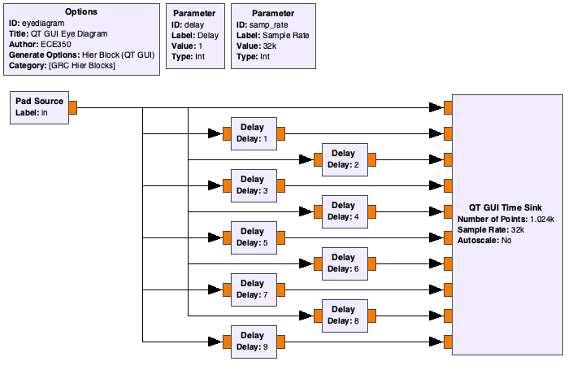

## Objectives

This part of the lab is a guide to measuring bit rates of real FSK signals. In it you will:

- learn about GNU Radio Heirarchal blocks

- use the flowgraph constructed during the past lab to demodulate an FSK signal and measure its bit rate

---

## Part 1 Deliverables

- There are 3 questions in this part. They are clearly indicated.
  - The question requires approximately 1 line of writing, and will generally address a concept. Answer the question and submit a single page containing the answers to your TA at the end of the lab.

---

## Eye diagrams in GNU Radio

### Compiling a QT GUI eye diagram heirarchal block

Download and open [this grc file](./data/heir-eyediagram.grc). Notice that instead of *Variable* blocks, there are *Parameter* blocks and the flowgraph is fed by a *Pad Source* block.

   
  __*Flowgraph of the heirarchal eye diagram block*__

Try to execute this flowgraph. Nothing happens because this has been designed to be a _Heirarchal_ block. Heirarchal blocks can be compiled into a block which becomes available for your other GRC flowgraphs.

Open the *Options* block and check that the *Generate Options* parameter is set to *Hier Block (QT GUI)*.

- The *Category* parameter controls where it can be found in the GRC search panel. This means that when compiled, your block will be available in the category called "GRC Hier Blocks".

Generate the flowgraph using the  button, instead of executing it.

Open a new flowgraph, add a *Signal Source* of type *Float* and connect it to a *Throttle* block.

- Set the *Waveform* parameter to either "Cosine" or "Sine".

Now look for your newly built heirarchal block. If it is not there, you can reload all of the blocks with the .

Add a *QT GUI Range* block to control the delay of the *QT GUI Eye Diagram* block.

- Set the *Type* to "Int"
- Give it a default value of 1, a minimum of 0 and a maximum of 50
- Call the variable `delay`
- Set the *Delay* parameter of the *QT GUI Eye Diagram* block using this variable

Also set the sample rate argument in the *QT GUI Eye Diagram* to `samp_rate`.
  
Execute the flowgraph, now change the delay using the *QT GUI Range* slider until a clear eye diagram is visible. It should look like the following figure when you are at a delay of 16 samples.

   
  __*Eye diagram for a 1 kHz sine wave*__

You can click on the data labels ("Data 0", "Data 1", etc) to enable and disable different streams. Remember that each stream is just a delayed version of the input. As you disable streams you will see the redundancy in some of them.

Because this is a sine wave with a bit message of `101010...`, you will get a perfect eye diagram with only two streams (one delayed).





This flowgraph is not a deliverable.





## Deliverables

From this lab part, keep the following for later submission to your TA:

- The answers to three deliverable questions.
